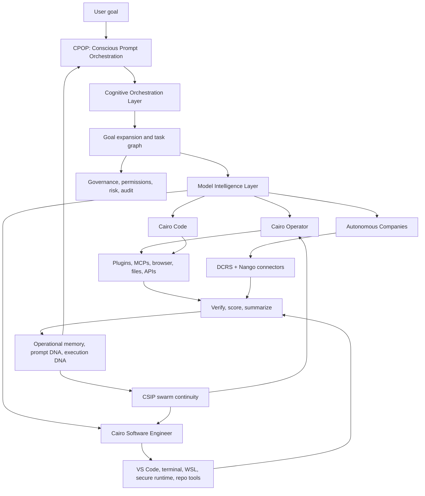
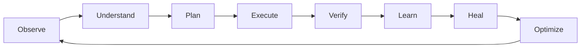

<p align="center">
  
</p>

# CAIRO Conscious Harness

<p align="center">
  <a href="https://colomboai-com.github.io/CAIRO-Conscious-Harness/"></a>
  <a href="https://cairo.colomboai.com"></a>
  <a href="https://cairo.sh"></a>
  
</p>

**CAIRO Conscious Harness is the next-generation AI agent harness for software-first operational intelligence.** It turns user goals into governed execution across models, swarms, tools, memory, codebases, documents, autonomous companies, and enterprise systems.

CAIRO is designed around one simple principle:

> Users should not prompt agents. CAIRO prompts agents for users.

Most AI products still expect people to know prompt engineering, context engineering, model routing, tool selection, and workflow design. CAIRO moves that burden into the platform. A user gives a goal. CAIRO expands it, routes it, decomposes it, assigns agents, executes through governed tools, verifies outputs, learns from the run, and improves the next run.

[Open the public site](https://colomboai-com.github.io/CAIRO-Conscious-Harness/) | [Use Cairo WebUI](https://cairo.colomboai.com) | [Visit Cairo.sh](https://cairo.sh) | [Read the buildout tracker](BUILDOUT.md)

---

## About

CAIRO Conscious Harness is not just a chatbot, coding assistant, agent framework, workflow builder, or model router.

It is an operational layer for intelligent work:

| Layer | What CAIRO does |
| --- | --- |
| Goal layer | Converts natural user goals into expanded intent, task graphs, execution policies, and measurable outcomes. |
| Prompt layer | Generates, compresses, optimizes, and evolves prompts for agents so users do not have to. |
| Model layer | Routes across software, local models, ColomboAI-MC-1, OpenRouter, Ollama, Hugging Face, and frontier providers. |
| Agent layer | Assigns Cairo Operator, Cairo Code, Cairo Software Engineer, autonomous company operators, and specialist swarms. |
| Tool layer | Connects plugins, MCPs, browser, terminal, files, documents, databases, APIs, and enterprise systems. |
| Memory layer | Records operational memory, prompt DNA, execution DNA, user preferences, learned workflows, and long-horizon checkpoints. |
| Governance layer | Keeps actions observable, permissioned, reversible where possible, auditable, and security-aware. |

---

## Core Innovations

| Innovation | Purpose |
| --- | --- |
| **Software-First Intelligence** | Uses deterministic software, cached state, memory, local models, and smaller models before expensive frontier inference. |
| **Conscious Prompt Orchestration Protocol (CPOP)** | Converts goals into intent, task graphs, optimized prompts, agent assignments, prompt compression, and prompt DNA. |
| **Cognitive Orchestration Layer (COL)** | Sits between the user and agents so CAIRO, not the user, performs prompt engineering, context engineering, and workflow design. |
| **Model Intelligence Layer** | Lets CAIRO choose the right model hierarchy by default while giving users control over custom model routing. |
| **Chain Swarm Intelligence Protocol (CSIP)** | Coordinates long-horizon swarms, role assignment, regeneration, memory inheritance, and execution continuity. |
| **Operational DNA** | Captures successful execution patterns so future runs inherit what worked instead of starting from scratch. |
| **Prompt DNA** | Stores proven prompt structures, tool patterns, context strategies, and evaluation results for future tasks. |
| **ODIL Document Intelligence** | Uses document conversion and operational extraction so PDFs, docs, slides, sheets, and knowledge assets become executable context. |
| **DCRS + Nango Connectivity** | Provides governed connector readiness for external business systems, APIs, and cross-application workflows. |
| **Self-Configuration Protocol (SCP)** | Lets users opt in to Cairo-recommended tools, skills, MCPs, models, workflows, security settings, and memory configuration. |
| **Generative UI Outputs** | Moves beyond plain text into interactive, inspectable, task-aware outputs for operator workflows. |
| **Security and Self-Healing** | Adds readiness for sandboxed execution, risk scoring, audit trails, scanner adapters, recovery loops, and operational repair. |

---

## Why It Matters

The old agent pattern is:

```text
Human -> Prompt -> Agent -> Result
```

CAIRO is built for the next pattern:

```text
Human Goal
  -> Intent Analysis
  -> Goal Expansion
  -> Task Graph
  -> Prompt Generation
  -> Model Routing
  -> Agent and Swarm Assignment
  -> Governed Execution
  -> Verification
  -> Memory
  -> Prompt and Operational Evolution
  -> Outcome
```

That shift is the difference between asking AI for help and operating with an AI system.

---

## Comparative Matrix

This table is not meant to diminish excellent tools like Hermes, Codex, or Claude Code. They each push the field forward. CAIRO's goal is to combine the strongest agent patterns into a broader operational harness.

| Capability | Hermes Agent | Codex | Claude Code | Typical agent frameworks | CAIRO Conscious Harness |
| --- | --- | --- | --- | --- | --- |
| Primary shape | Self-improving personal agent | Coding and task workspace | Coding agent | Agent SDKs and examples | Full operational AI harness |
| User interaction | User prompts agent | User asks coding/task agent | User asks coding agent | Developer wires flows | User gives goals; CAIRO engineers execution |
| Prompt orchestration | Strong learning loop | Task context and tool use | Strong code context | Usually manual | CPOP, prompt DNA, compression, goal expansion |
| Model routing | Multi-provider support | Platform-managed | Provider-managed | Developer-defined | Model Intelligence Layer with default and custom routing |
| Software-first execution | Runtime and tools | Strong for code tasks | Strong for code tasks | Varies | Core platform principle across all work |
| Swarm intelligence | Subagents and workflows | Subagents in workspace | Agentic coding flows | Often custom | CSIP long-horizon swarms with inherited memory |
| Coding surface | Terminal and tools | Polished coding workspace | Polished code agent | Depends on implementation | Cairo Code plus Cairo Software Engineer |
| Autonomous companies | Not primary focus | Not primary focus | Not primary focus | Custom build | Native product surface for autonomous company operators |
| Connectors | Messaging and tools | Plugins and connectors | MCP ecosystem | Custom integrations | Plugins, MCPs, DCRS, Nango, enterprise-ready connectors |
| Memory | Strong personal memory and skills | Session/project context | Project context | Varies | Operational memory, prompt DNA, execution DNA, LHTK |
| Governance | Runtime controls | Permission controls | Permission controls | Developer-defined | Audit, approvals, policies, risk, security, self-healing |
| Output experience | CLI, messaging, dashboard | Rich workspace | Rich terminal/editor flow | Usually text/API | Operator workspace, dashboards, generative UI, previews |

---

## Product Surfaces

| Surface | What it is for |
| --- | --- |
| **Cairo Operator** | General goal execution, research, browser work, documents, workflows, and autonomous operations. |
| **Operator Dashboard** | Live view of agent state, models, tools, memory, execution logs, safety, progress, outputs, and subagents. |
| **Cairo Code** | Terminal-style coding surface with multiline input, command workflows, model selection, permissions, and streaming execution. |
| **Cairo Software Engineer** | Autonomous engineering environment for large codebases, refactoring, builds, tests, secure runtime, repository state, and self-healing workflows. |
| **Autonomous Companies** | Marketplace, company creation, installed companies, operators, and business execution systems. |
| **Plugins and MCPs** | Plugin, skill, MCP, and marketplace management for extending Cairo capabilities. |
| **Model Intelligence** | Default and custom model hierarchy, frontier models, OpenRouter, Ollama, Hugging Face, local models, and policy control. |
| **Memory** | Operational memory, prompt DNA, execution history, user preferences, and long-horizon learning. |
| **Swarm Intelligence** | Multi-agent task decomposition, specialist roles, progress, coordination, and regeneration. |
| **Settings** | Account, billing, voice, display, remote, system, overview, permissions, environment, and platform configuration. |

---

## Architecture



---

## Runtime Loop

Every CAIRO run follows the Conscious Runtime cycle:



---

## Install and Access

### WebUI

The fastest way to try CAIRO is through the web experience:

- [https://cairo.colomboai.com](https://cairo.colomboai.com)
- [https://cairo.sh](https://cairo.sh)
- [GitHub Pages overview](https://colomboai-com.github.io/CAIRO-Conscious-Harness/)

### Developer Preview: Windows

```powershell
git clone https://github.com/ColomboAI-com/CAIRO-Conscious-Harness.git
cd CAIRO-Conscious-Harness
```

For the full local platform, run the backend and UI repositories used by the active product:

```powershell
git clone https://github.com/ColomboAI-com/cairo-backend.git
git clone https://github.com/ColomboAI-com/cairo-ui.git
```

Recommended local dependencies:

- Windows 10/11
- PowerShell
- Git
- Node.js 22+
- Python 3.11+
- WSL 2 for Linux runtime workflows
- Visual Studio Code for Cairo Software Engineer handoff

### Developer Preview: macOS

```bash
git clone https://github.com/ColomboAI-com/CAIRO-Conscious-Harness.git
cd CAIRO-Conscious-Harness
```

For the full local product:

```bash
git clone https://github.com/ColomboAI-com/cairo-backend.git
git clone https://github.com/ColomboAI-com/cairo-ui.git
```

Recommended local dependencies:

- macOS 13+
- Git
- Node.js 22+
- Python 3.11+
- Docker for containerized runtime paths
- Visual Studio Code

### Developer Preview: Linux

```bash
git clone https://github.com/ColomboAI-com/CAIRO-Conscious-Harness.git
cd CAIRO-Conscious-Harness
```

For the full local product:

```bash
git clone https://github.com/ColomboAI-com/cairo-backend.git
git clone https://github.com/ColomboAI-com/cairo-ui.git
```

Recommended local dependencies:

- Ubuntu 22.04+ or equivalent
- Git
- Node.js 22+
- Python 3.11+
- Docker
- Visual Studio Code or compatible editor

> Installer automation is part of the platform roadmap. Until the installer is published, the WebUI is the fastest access path and the developer-preview path uses the Cairo backend and Cairo UI repositories directly.

---

## Quick Start

1. Open [Cairo WebUI](https://cairo.colomboai.com) or a local Cairo UI build.
2. Start with a goal, not a prompt.
3. Choose the default model routing policy or configure Model Intelligence manually.
4. Turn on optional protocols such as SCP or CPOP where appropriate.
5. Let CAIRO expand the goal, create a task graph, assign agents, select tools, and execute.
6. Inspect progress, outputs, sources, files, terminal traces, and memory in the workspace.
7. Promote successful runs into prompt DNA, operational DNA, skills, MCPs, or autonomous company workflows.

---

## Conscious Home Folder

CAIRO introduces a transparent local operational filesystem:

```text
~/.cairo-conscious/
  config/
  identity/
  memory/
  prompts/
    templates/
    dna/
    optimizations/
    histories/
    benchmarks/
    evaluations/
  efficiency/
  odil/
  skills/
  swarms/
  long_horizon/
  heartbeats/
  harnesses/
  autonomous_companies/
  dcrs/
  nango/
  security/
  sessions/
  plugins/
  mcps/
  hooks/
  themes/
  ui/
  logs/
```

---

## API and Runtime Readiness

The active implementation connects the public Harness concept to the broader Cairo platform:

| Area | Example contracts |
| --- | --- |
| Harness health | `/api/v1/conscious-harness/health`, `/readiness`, `/health/smoke` |
| Launch control | `/launch/runbook`, `/launch/preflight`, `/launch/manifest`, `/launch/release-candidate` |
| Evidence and audit | `/launch/evidence`, `/launch/audit-package`, `/security/audit` |
| Models | `/v1/models`, model routing policy, custom routing order |
| Plugins and MCPs | plugin registry, marketplace registry, skill creation, MCP creation |
| Memory and swarm | memory aggregate, swarm aggregate, long-horizon checkpoints |
| Software engineer | repository scan, tool readiness, secure runtime, mission creation, execution loop |

---

## Engineering Laws

1. **Software first:** never call a frontier LLM if software can solve the task.
2. **Smallest capable intelligence first:** use the cheapest reliable layer before escalation.
3. **Goal over prompt:** users define outcomes; CAIRO engineers the execution.
4. **Memory compounds:** every successful workflow should improve future workflows.
5. **Governance by default:** actions must be observable, controllable, auditable, and safe.
6. **Self-healing operations:** failures should trigger repair before escalation.
7. **Open extensibility:** plugins, skills, MCPs, models, and connectors should extend the platform without fragmenting it.

---

## Status

CAIRO Conscious Harness is in active buildout and production hardening. The current work spans:

- Cairo Operator workspace polish and backend wiring.
- Cairo Software Engineer runtime, secure execution, repository readiness, and developer tool integration.
- Model Intelligence, default/custom routing, and provider catalogs.
- Plugins, skills, MCPs, and marketplace creation.
- CPOP, SCP, swarm intelligence, memory, and prompt DNA.
- DCRS, Nango, ODIL, document intelligence, and enterprise connectors.
- Security, self-healing, readiness, smoke checks, and audit surfaces.

The next hardening lane is live environment validation: deployed database contracts, live credentials, browser-level UI smoke testing, connector activation, end-to-end authorization, and CI-backed contract tests across every sidebar feature.

---

## Repository Contents

- `index.html` - GitHub Pages site.
- `styles.css` - Responsive visual system for the public page.
- `script.js` - Lightweight animated runtime telemetry for the architecture visual.
- `BUILDOUT.md` - Implementation tracker and launch-readiness notes.
- `assets/cairo-conscious-harness-hero.svg` - README hero banner.
- `assets/cairo-logo-gradient.svg` - Official Cairo gradient logo for light and dark surfaces.
- `assets/cairo-logo-white.svg` - Official Cairo white logo for dark surfaces.
