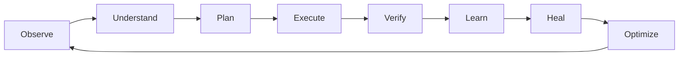

# CAIRO Conscious Harness

**The beginning of Operational Consciousness Infrastructure.**

CAIRO Conscious Harness is a software-first, self-healing, self-improving, token-efficient, multi-model, multi-harness AI runtime. It is designed for the next stage of AI systems: not just AI that answers, and not only AI that acts, but AI that operates.

CAIRO treats large language models as powerful escalation layers, not as the operating system. Deterministic software, memory, workflows, local processors, cached intelligence, and governance execute first. Frontier models are called only when they are truly needed.

[Open the GitHub Pages site](https://colomboai-com.github.io/CAIRO-Conscious-Harness/)

## Why It Exists

Most AI products are LLM-first:

- Prompts become the operating layer.
- Model calls happen constantly.
- Cost, latency, and token usage scale aggressively.
- Reliability depends heavily on repeated inference.

CAIRO is built around a different premise:

> Maximum operational intelligence per token.

The Conscious Harness runtime continuously observes, understands, plans, executes, verifies, learns, heals, and optimizes. This loop lets CAIRO run as operational infrastructure across users, companies, workflows, agents, harnesses, and autonomous ecosystems.

## Core Runtime Loop



## Operating Modes

| Mode | Behavior | Governance |
| --- | --- | --- |
| Reactive Intelligence | User gives an instruction and CAIRO executes. | Standard user control |
| Assisted Proactive Intelligence | CAIRO recommends improvements, fixes, and next actions. | User approval |
| Autonomous Proactive Intelligence | CAIRO acts inside defined goals, policies, budgets, and confidence thresholds. | Observable, auditable, reversible where possible |

## Architecture

CAIRO Conscious Harness v0.1 is organized into six major systems:

| Layer | Purpose |
| --- | --- |
| Conscious Command Center | Goal Mode, Swarm View, Heartbeat Timeline, Efficiency Dashboard, Security Center, and Meta-Harness Control Panel |
| Conscious Runtime Core | Intent routing, goal planning, task graph execution, verification, learning, self-healing, and recommendations |
| Conscious Efficiency Engine | Local processor, model router, token meter, context compression, cache manager, cost optimizer, and software-first policies |
| Heartbeat and Proactive Engine | User, company, security, efficiency, codebase, growth, and infrastructure heartbeats |
| Meta-Harness Engine | Adapters and governance for Hermes, Codex-style agents, Claude Code, OpenClaw, internal agents, and custom harnesses |
| Governance and Observability | Risk classification, approval gates, audit logs, kill switches, budget controls, and rollback systems |

## Intelligence Hierarchy

CAIRO always attempts the smallest capable intelligence layer first:

1. **Layer 0: Native Software Execution**  
   Scheduling, workflow routing, permissions, notifications, state management, and orchestration without model calls.

2. **Layer 1: Local Conscious Processor**  
   Intent classification, lightweight planning, workflow matching, memory ranking, security pre-checks, and escalation decisions.

3. **Layer 2: Specialized Models**  
   Focused coding, design, security, OCR, analysis, or domain-specific models.

4. **Layer 3: Frontier Intelligence**  
   MC-1, GPT-class models, Claude-class models, sovereign models, or other high-capability systems when required.

## 72-Hour MVP Target

The first public version proves five things:

- CAIRO is proactive, not only reactive.
- CAIRO is software-first, not LLM-first.
- CAIRO is token-efficient, using local and small models before frontier models.
- CAIRO is self-healing, able to detect and repair failures.
- CAIRO is a meta-harness, able to operate and govern other harnesses, agents, tools, and autonomous companies.

### MVP Demo Flow

1. A user creates a high-level goal.
2. CAIRO expands it into subgoals.
3. CAIRO assigns internal agents and external harnesses.
4. CAIRO runs proactive heartbeats.
5. CAIRO executes software-first.
6. CAIRO uses local intelligence before large models.
7. CAIRO tracks tokens saved.
8. CAIRO detects a failure.
9. CAIRO self-heals the workflow.
10. CAIRO shows everything in a live Command Center.

## Proposed API Surface

```http
POST /harness/goals/create
POST /harness/goals/expand
GET  /harness/goals/:id/status

POST /harness/tasks/create
POST /harness/tasks/assign
POST /harness/tasks/execute
GET  /harness/tasks/:id/timeline

POST /harness/heartbeat/run
GET  /harness/heartbeat/history

POST /harness/models/route
GET  /harness/models/metrics

POST /harness/meta/register
POST /harness/meta/assign
GET  /harness/meta/status

POST /harness/heal/analyze
POST /harness/heal/repair

GET  /harness/efficiency/metrics
GET  /harness/security/events
GET  /harness/recommendations
```

## Data Model Additions

Initial tables and event streams:

- `conscious_goals`
- `conscious_tasks`
- `heartbeat_runs`
- `model_routing_events`
- `harness_registry`
- `self_healing_events`
- `security_events`

## Engineering Laws

1. **Software first:** never call a frontier LLM if software can solve the task.
2. **Smallest intelligence first:** use the smallest capable model before escalation.
3. **Continuous optimization:** every workflow should become more efficient over time.
4. **Proactive intelligence:** CAIRO should not wait for prompts when autonomous action is safe and useful.
5. **Self-healing operations:** failures should trigger repair before escalation.
6. **Meta-harness orchestration:** CAIRO should be able to govern and operate external harnesses.
7. **Governance by default:** every action must be observable, controllable, auditable, and safe.

## Repository Contents

- `index.html` - GitHub Pages landing page.
- `styles.css` - Responsive visual system for the public page.
- `script.js` - Lightweight animated runtime telemetry for the architecture visual.

## Status

This repository currently contains the public site and architecture README for CAIRO Conscious Harness. The implementation roadmap is based on the CAIRO Conscious Harness engineering vision and the 72-hour swarm build architecture.

