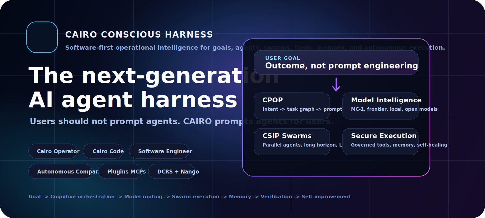
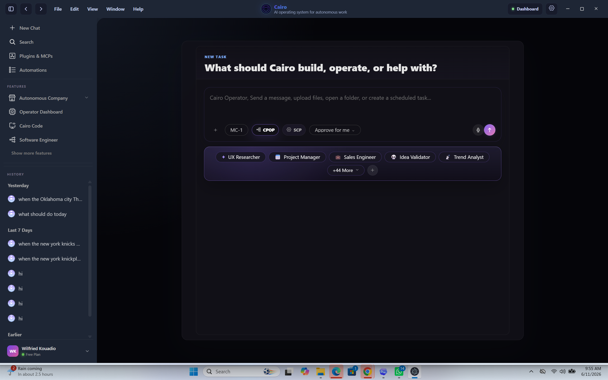
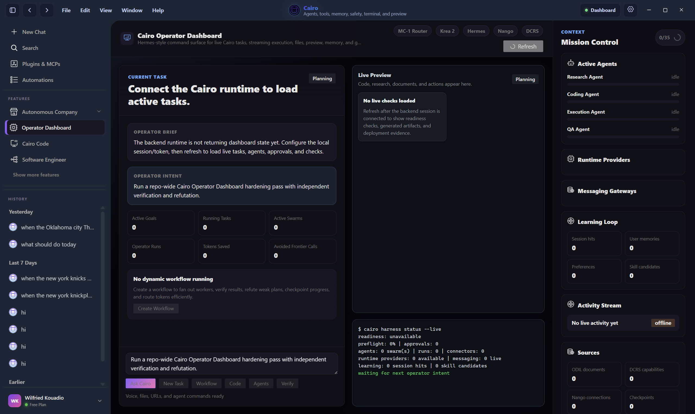
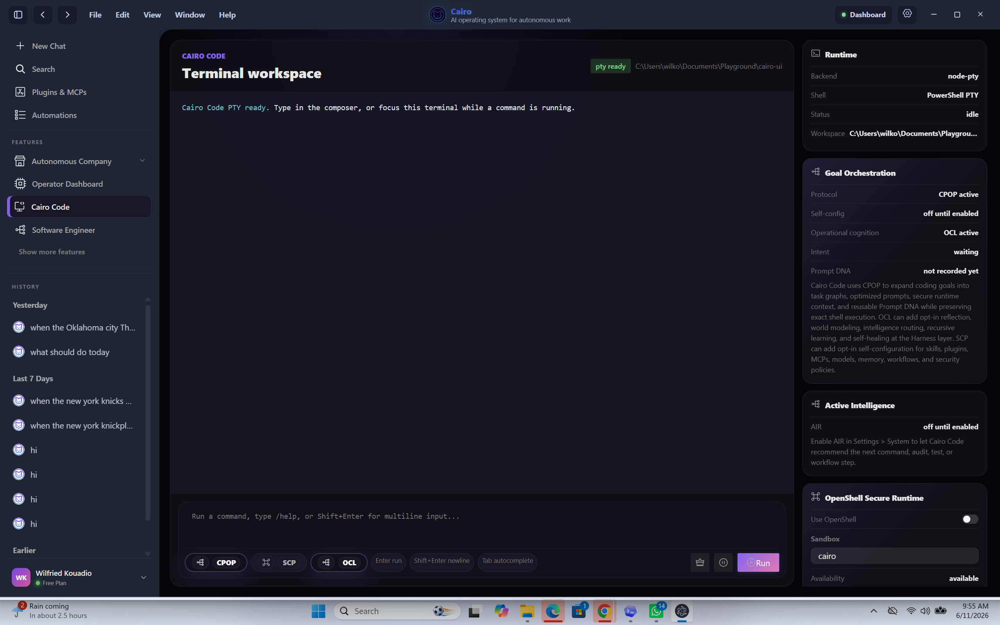
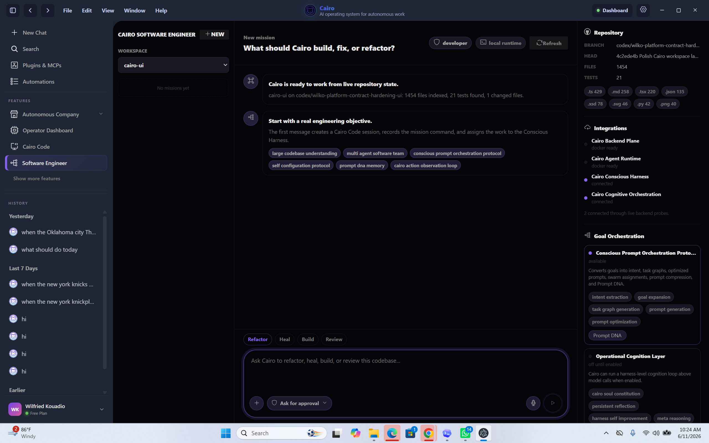
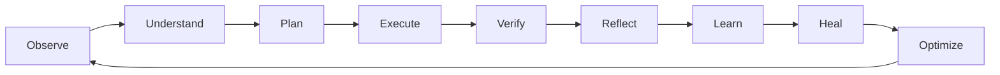

<p align="center">
  
</p>

# CAIRO Conscious Harness

<p align="center">
  <a href="https://colomboai-com.github.io/CAIRO-Conscious-Harness/"></a>
  <a href="https://cairo.colomboai.com"></a>
  <a href="https://cairo.colomboai.com/download"></a>
  
</p>

> The World's First Software-First Operational Consciousness Infrastructure.

CAIRO is a new category of intelligent system designed to operate, learn, heal, improve, and execute continuously across workflows, companies, software systems, and connected operational environments.

Instead of focusing exclusively on making models smarter, CAIRO focuses on making systems smarter.

Built on the principles of:

* Software-First Intelligence
* Hybrid Inference
* Long-Horizon Swarm Intelligence
* Self-Healing Operations
* Self-Improving Systems
* Operational Connectivity
* Autonomous Execution

CAIRO continuously coordinates:

* workflows,
* intelligent swarms,
* software systems,
* enterprise operations,
* autonomous companies,
* AI harnesses,
* and connected ecosystems.

Every execution cycle follows:

```txt
Observe
↓
Understand
↓
Plan
↓
Execute
↓
Verify
↓
Reflect
↓
Learn
↓
Heal
↓
Optimize
```

This creates an operational intelligence system that continuously improves execution quality, operational efficiency, and long-horizon performance over time.

## Operational Intelligence

Intelligence is distributed across:

* software,
* workflows,
* memory,
* orchestration,
* connectivity,
* swarm coordination,
* and models.

CAIRO is built around a simple belief:

## Better Systems Create Better Intelligence.

Instead of measuring intelligence by compute consumption, CAIRO optimizes for:

## Maximum Intelligence Per Token.

A user should not need to master:

* prompt engineering,
* context engineering,
* model routing,
* tool selection,
* workflow design,
* agent orchestration,
* or long-horizon planning.

A user provides a goal.

CAIRO expands it, decomposes it, generates execution graphs, assigns swarms, selects capabilities, routes intelligence through the most efficient layer, executes through governed tools, verifies outcomes, learns from execution, heals failures, and continuously improves future performance.

The future of intelligence is not simply larger models.

The future of intelligence is:

## Better Operational Systems.

[Open the public site](https://colomboai-com.github.io/CAIRO-Conscious-Harness/) | [Use Cairo WebUI](https://cairo.colomboai.com) | [Download Cairo Desktop](https://cairo.colomboai.com/download)

---

## Product Screens

### Cairo Workspace



The main Cairo workspace is a goal-first command surface. It gives users one place to start tasks, choose model routing, enable orchestration protocols such as CPOP and SCP, attach files, dictate instructions, select operators, and launch governed execution.

### Cairo Operator Dashboard



The Operator Dashboard is Cairo's mission-control view. It shows active tasks, agents, runtime providers, live preview, execution terminal, activity stream, sources, connectors, memory state, and operational readiness.

### Cairo Code



Cairo Code is the terminal workspace for developers and operators. It supports command execution, runtime status, model and protocol controls, OpenShell readiness, secure terminal workflows, and coding-oriented orchestration.

### Cairo Software Engineer



Cairo Software Engineer is the autonomous engineering surface for large codebases. It understands repositories, routes engineering goals, coordinates secure runtime tools, uses software-first planning, and supports refactor, build, review, test, repair, and handoff workflows.

---

## About

CAIRO Conscious Harness is not a chatbot, a simple coding assistant, or a thin wrapper around a model API. It is an operating harness for intelligent work.

| Layer | What Cairo does |
| --- | --- |
| Goal layer | Converts natural goals into intent, task graphs, execution policies, and measurable outcomes. |
| Prompt layer | Generates, compresses, optimizes, and evolves prompts so users do not have to. |
| Model layer | Routes across Cairo MC-1, local models, OpenRouter, Ollama, Hugging Face, and frontier providers. |
| Agent layer | Coordinates Cairo Operator, Cairo Code, Cairo Software Engineer, autonomous companies, and specialist swarms. |
| Tool layer | Connects plugins, MCPs, browser, terminal, files, documents, APIs, databases, and enterprise systems. |
| Memory layer | Stores operational memory, prompt DNA, execution DNA, learned workflows, and long-horizon checkpoints. |
| Governance layer | Keeps work observable, permissioned, auditable, risk-aware, and recoverable. |

---

## Core Innovations

| Innovation | Purpose |
| --- | --- |
| **Software-First Intelligence** | Uses deterministic software, workflow logic, cached state, memory, and local intelligence before frontier model calls. |
| **Hybrid Inference** | Selects the smallest capable intelligence layer: software, local model, Cairo intelligence, or frontier provider. |
| **Conscious Efficiency Engine** | Reduces unnecessary model calls, compresses context, tracks token savings, and improves intelligence per token. |
| **Conscious Prompt Orchestration Protocol (CPOP)** | Turns goals into intent, task graphs, optimized prompts, swarm assignments, prompt compression, and prompt DNA. |
| **Self-Configuration Protocol (SCP)** | Lets users opt in to Cairo-recommended skills, plugins, MCPs, models, workflows, memory, governance, and security settings. |
| **Model Intelligence Layer** | Gives Cairo a default model hierarchy while letting users customize routing, providers, and model selection. |
| **Chain Swarm Intelligence Protocol (CSIP)** | Regenerates swarms over long horizons while preserving validated goals, memory, strategy, and operational DNA. |
| **Operational DNA** | Captures successful execution patterns so future work inherits what worked instead of starting from scratch. |
| **Prompt DNA** | Stores proven prompt structures, tool patterns, context strategies, and evaluation results for future runs. |
| **Engineered Memory Protocol (EMP)** | Stores operational abstractions, workflow graphs, strategic summaries, and learned execution patterns. |
| **Long-Horizon Task Kernel (LHTK)** | Enables checkpointing, entropy monitoring, state compression, recovery, and long-running task continuity. |
| **Operational Document Intelligence Layer (ODIL)** | Converts documents into structured operational knowledge before advanced reasoning is used. |
| **DCRS + Nango Connectivity** | Discovers capabilities and connects governed workflows to external systems, APIs, SaaS tools, and enterprise platforms. |
| **Self-Healing Operations** | Detects failure, drift, memory conflict, integration issues, and orchestration degradation, then repairs or reroutes. |
| **Generative UI Outputs** | Moves responses beyond text into interactive, inspectable, task-aware outputs for operator workflows. |

---

## Runtime Loop

Every Cairo run follows the Conscious Runtime cycle:



---

## Why Cairo Is Different

| Capability | Traditional chatbot | Coding-only agent | Agent framework | CAIRO Conscious Harness |
| --- | --- | --- | --- | --- |
| User input | Prompt | Coding request | Developer-defined workflow | Goal |
| Main job | Generate text | Help with code | Provide building blocks | Operate across work, code, tools, memory, and systems |
| Prompt engineering | User responsibility | Mostly user responsibility | Developer responsibility | Cairo responsibility |
| Model choice | Usually fixed | Platform managed | Developer configured | Default hierarchy plus user-configurable routing |
| Memory | Conversation history | Project/session context | Custom | Operational memory, prompt DNA, execution DNA |
| Long-horizon work | Weak | Limited | Custom | CSIP, LHTK, checkpoints, swarm regeneration |
| Governance | Minimal | Permission prompts | Custom | Risk, approvals, audit, security, self-healing |
| Output | Text | Text/code changes | API output | Workspace, dashboard, terminal, files, sources, previews, generative UI |

---

## Access Cairo

### WebUI

Use Cairo from the browser:

- [https://cairo.colomboai.com](https://cairo.colomboai.com)
- No installation required. Sign in, choose a workspace, and start with a goal.

### Desktop App

Download Cairo Desktop from the Cairo access page or the official release channel:

<p>
  <a href="https://cairo.colomboai.com/download"></a>
  <a href="https://github.com/ColomboAI-com/cairo-releases/releases/latest"></a>
  <a href="https://github.com/ColomboAI-com/cairo-releases/releases/download/v2.0.3/Cairo-2.0.3-mac-arm64.dmg"></a>
</p>

Choose the installer for your operating system, install Cairo Desktop, sign in, and connect your preferred model providers, local runtimes, and optional developer tools. Use the browser version from the same page if you prefer no-install access.

Supported desktop targets:

| Platform | Minimum guidance |
| --- | --- |
| Windows | Windows 10 or later. Recommended: PowerShell, Git, Visual Studio Code, WSL 2 for Linux/runtime workflows. |
| macOS | macOS 10.15 or later. Recommended: Git, Visual Studio Code, Docker if you plan to use containerized runtimes. |
| Linux | Ubuntu 18.04 or later. Recommended: Git, Visual Studio Code, Docker. |

All desktop downloads are designed for automatic updates, file system access, local processing, and secure-by-default operation. Cairo requires an internet connection and at least 4 GB RAM.

---

## Optional Local and Cloud Setup

Cairo can work with hosted providers, local models, and enterprise model gateways. Configure only what your workflow needs.

### Local Models

| Option | Why install it |
| --- | --- |
| Ollama | Run local models for private, low-cost, offline-friendly inference. |
| Hugging Face | Access open model catalogs, private models, and model assets. |

Recommended local path:

1. Install Ollama from [https://ollama.com/download](https://ollama.com/download).
2. Pull the local models your team wants to use.
3. Add Ollama in Cairo Settings > Model Intelligence.
4. Add Hugging Face credentials in Cairo Settings > Model Intelligence if your team uses Hugging Face models.

### Model Gateways

| Option | Why configure it |
| --- | --- |
| OpenRouter | Route across many hosted models from one provider gateway. |
| Cairo MC-1 | Use Cairo's default intelligence layer where available. |

### Optional Frontier APIs

These are optional. Cairo's model layer should route to them only when useful, authorized, and configured.

| Provider | Typical use |
| --- | --- |
| OpenAI | Advanced reasoning, coding, multimodal work, and tool workflows. |
| Anthropic | Long-context reasoning, coding, analysis, and document workflows. |
| Google Gemini | Multimodal reasoning, fast inference, and Google ecosystem tasks. |

Add API keys in Cairo Settings > Model Intelligence or your organization's managed secret store. Do not commit API keys into repositories.

### Developer and Runtime Tools

| Tool | Used by |
| --- | --- |
| Visual Studio Code | Cairo Software Engineer code handoff and repository work. |
| Git | Repository inspection, change tracking, and engineering workflows. |
| PowerShell | Windows-native terminal execution. |
| WSL 2 | Linux runtime workflows on Windows. |
| Docker | Optional sandbox/container workflows. |
| OpenShell | Optional secure execution layer for high-risk or sandboxed commands. |

---

## Product Surfaces

| Surface | What it is for |
| --- | --- |
| **Cairo Operator** | General goal execution, research, browser work, documents, workflows, and autonomous operations. |
| **Operator Dashboard** | Live view of tasks, agents, models, tools, memory, execution logs, safety, progress, outputs, and sources. |
| **Cairo Code** | Terminal-style coding surface with multiline input, command workflows, permissions, model routing, and streaming execution. |
| **Cairo Software Engineer** | Autonomous engineering workspace for large codebases, refactoring, testing, builds, secure runtime, and self-healing workflows. |
| **Autonomous Companies** | Marketplace, company creation, installed companies, operators, and business execution systems. |
| **Plugins and MCPs** | Plugin, skill, MCP, and marketplace management for extending Cairo capabilities. |
| **Model Intelligence** | Default and custom model hierarchy, local models, OpenRouter, Hugging Face, frontier models, and policy control. |
| **Memory** | Operational memory, prompt DNA, execution history, user preferences, and long-horizon learning. |
| **Swarm Intelligence** | Multi-agent task decomposition, specialist roles, progress tracking, coordination, and regeneration. |

---

## Architecture


---

## Repository Contents

- `README.md` - Public product overview and setup guidance.
- `index.html` - Static GitHub Pages product page.
- `styles.css` - Static visual styling for the public page.
- `assets/` - Public screenshots and brand images.
